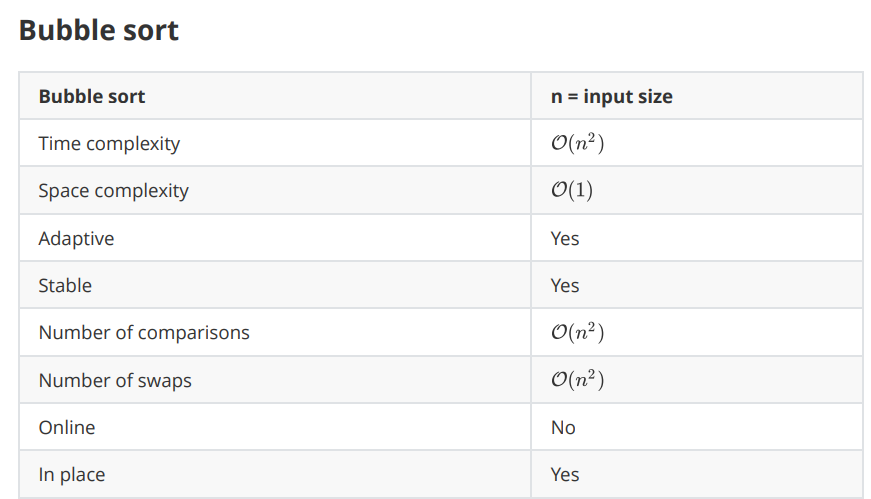
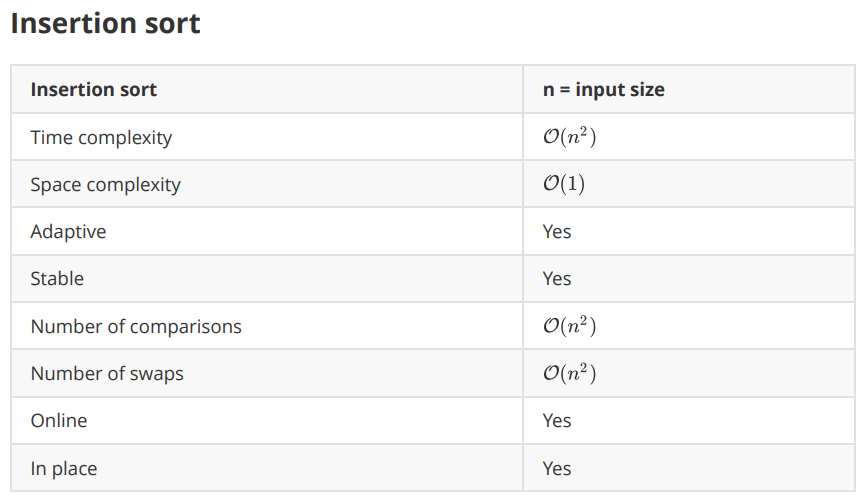
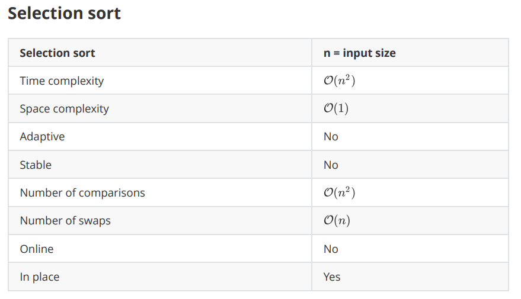
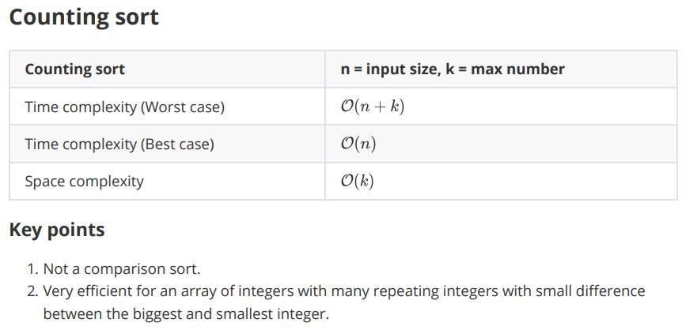

### Сложност и алгоритми. Алгоритми за търсене и сортиране.
Сложност: Функция по големината на входа (N)

**Пример**: 

 - При търсене в масив - големината на входа е големината на масива
 -  При проверка число дали е просто - големината на входа е числото.

При анализа на алгоритми НЕ се интересуваме от точната функция!
Интересуваме се само то асимптотиката на функцията.
Колко бързо расте функцията при n->безкрайност.

### Определяне на сложност по време и памет
Примери в Solutions - Complexity

Cheatsheet - https://www.bigocheatsheet.com/

### Алгоритми за търсене
* Linear Seach - сложност O(n)
* Binary Search - сложност O(log n)

### Алгоритми за сортиране

Как работят нагледно: https://visualgo.net/en/sorting

Разгледайте качените cpp-та успоредно с интерактивните примери в visualgo

*Стабилна сортировка - сортировка, при която два елемента с еднакви стойности остават в същата последователност в сортирания масив, в каквато са били и в първоначалния

В курса по УП ще разгледаме следните сортировки:

**Note!**: Не трябва да знаете свойствата, които не са показани в час

#### Bubble sort (stable)
  

#### Insertion sort (stable)
  

#### Selection sort (unstable)
  

#### Counting sort (stable)
  
